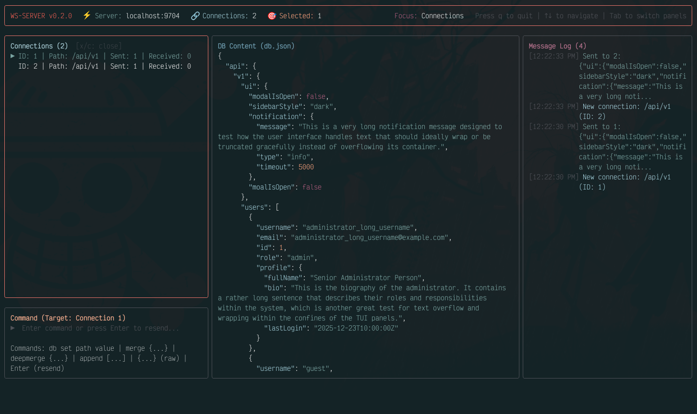

# @abidibo/ws-server-ftw

[](https://github.com/abidibo/ws-server-ftw/actions)
[](https://coveralls.io/github/abidibo/ws-server-ftw?branch=master)

> Mock websocket endpoints with a beautiful Terminal User Interface (TUI)



@abidibo/ws-server-ftw is a powerful development tool that lets you easily mock WebSocket APIs with a rich, interactive terminal interface. Inspired by [json-server](https://github.com/typicode/json-server), it provides real-time WebSocket mocking with visual feedback and control.

## Features

- **Interactive TUI**: Beautiful terminal interface built with Ink (React for terminals)
- **Real-time Connection Monitoring**: Track active WebSocket connections as they connect and disconnect
- **Live Message Logging**: See all incoming and outgoing messages in real-time with color-coded syntax highlighting
- **JSON Database Editor**: View and edit your mock database with syntax-highlighted JSON
- **Multiple Command Operations**: Send, merge, deep-merge, or append data to connected clients
- **Path-based Routing**: Serve different data based on WebSocket connection paths
- **Auto-Responder**: Define rules to automatically respond to incoming client messages based on pattern matching
- **Message Filtering & Search**: Filter the message log by text search or message type to quickly find what you need

# Install

[](https://www.npmjs.com/package/@abidibo/ws-server-ftw)

    npm install @abidibo/ws-server-ftw --save-dev

# Getting Started

## Quick Start

Start the TUI application with your mock database file:

```bash
ws-server -i mydb.json
```

The interactive terminal interface will launch, showing real-time connection status, database content, and message logs.

## Command Line Options

```bash
$ ws-server -h

usage: ws-server [-h] [-v] [-p PORT] -i DB

ws-server cli

Optional arguments:
  -h, --help            Show this help message and exit.
  -v, --version         Show program's version number and exit.
  -p PORT, --port PORT  WebSocket server port (default: 9704)
  -i DB, --input DB     JSON or js input file which exports an object
```

## TUI Interface Overview

The terminal interface consists of five main panels:

### 1. Status Bar (Top)

Displays server status, port number, and database file path.

### 2. Connections List (Left Panel Top)

- Shows all active WebSocket connections
- Displays connection ID and path for each client
- Navigate connections using **↑/↓ arrow keys** when panel is focused
- Selected connection is highlighted
- Press **x** or **c** to close the selected connection when panel is focused
- Shows "No connections" when no clients are connected

### 3. Command Input (Left Panel Bottom)

Interactive command prompt for sending data to the selected connection. Available commands:

- **`db set <path> <value>`** - Set a value in the database at a specific path
  - Example: `db set api.v1.ui.modalIsOpen true`
  - Example: `db set api.v1.users [{"id": 1, "name": "John"}]`

- **`merge {...}`** - Shallow merge new data with current data
  - Example: `merge {"ui": {"foo": "bar"}}`
  - Replaces entire top-level keys

- **`deepmerge {...}`** - Deep merge new data with current data
  - Example: `deepmerge {"ui": {"modalIsOpen": false}}`
  - Merges nested properties recursively
  - Arrays are concatenated

- **`append [...]`** - Append items to an array
  - Example: `append [{"username": "newuser"}]`
  - Only works if the endpoint data is an array

- **`{...}`** - Send raw JSON data
  - Example: `{"status": "updated"}`
  - Replaces all data for the endpoint

- **`Enter`** (empty input) - Resend the original data

### 4. DB Content (Middle Panel)

- Shows the current database content with **JSON syntax highlighting**
- Colors: keys (cyan), strings (green), numbers (yellow), booleans (magenta), null (gray)
- Scroll through large JSON files using **↑/↓ arrow keys** when panel is focused
- Press **r** to refresh database content from file when panel is focused
- Updates in real-time when database is modified via `db set` commands

### 5. Message Log (Right Panel)

- Displays all WebSocket messages in real-time
- Color-coded by type:
  - **Sent** (green): data sent to clients
  - **Received** (cyan): messages received from clients and connection events
  - **Auto-response** (yellow): automatic replies triggered by rules
  - **Error** (red): error messages
- Shows timestamp, connection ID, and message content
- Auto-scrolls to show latest messages
- Scroll through history using **↑/↓ arrow keys** when panel is focused
- Shows "No messages yet" when log is empty
- Supports **filtering and search** (see below)

#### Message Filtering & Search

When the Message Log panel is focused, you can filter messages to cut through the noise:

- **`/`** — Enter search mode. A text input appears at the bottom of the panel. Type to filter messages by text content (case-insensitive). Press **Enter** to confirm the search and go back to scroll mode, or **Escape** to clear the search text and exit search mode.
- **`t`** — Cycle through type filters: All → Sent → Received → Auto → Error → All. Only messages of the selected type are shown.
- **`Escape`** — Reset the type filter back to All (when not in search mode).

Filters can be combined — for example, press `t` to show only "Sent" messages, then `/` to search within them.

When a filter is active, the header shows the filtered count vs the total (e.g. `Message Log (5/42)`) and the active filter indicators next to it.

## Navigation & Controls

- **Tab** - Cycle focus through panels (Connections → Command → DB Content → Message Log)
- **↑/↓ Arrow Keys** - Navigate within focused panel
  - In Connections List: Select different connections
  - In DB Content: Scroll through JSON
  - In Message Log: Scroll through message history
- **x** or **c** - Close the selected connection (when Connections List panel is focused)
- **r** - Refresh database content from file (when DB Content panel is focused)
- **/** - Enter search mode to filter messages by text (when Message Log panel is focused)
- **t** - Cycle through message type filters (when Message Log panel is focused)
- **Escape** - Clear search text / reset type filter (when Message Log panel is focused)
- **q** or **Ctrl+C** - Quit the application
- **Enter** - Submit command (when Command Input is focused)

The currently focused panel is highlighted with a bright red border, while unfocused panels have gray borders.

## How It Works

@abidibo/ws-server-ftw serves data from a JSON or JavaScript file through WebSocket connections. The server uses path-based routing:

- Path `/foo/bar` serves `db['foo']['bar']` from your database file
- Path `/api/v1/users` serves `db['api']['v1']['users']`

When a client connects:

1. The server automatically sends the data for the requested path
2. The connection appears in the Connections List panel
3. You can send additional data using commands in the Command Input panel
4. All messages are logged in the Message Log panel

A JavaScript file can be used instead of JSON to export dynamic data or perform operations.

# Example Workflow

## 1. Create Your Database File

Create `db.json`:

```json
{
  "api": {
    "v1": {
      "ui": {
        "modalIsOpen": true,
        "sidebarStyle": "dark"
      },
      "users": [
        {
          "username": "admin",
          "email": "admin@example.com",
          "id": 1,
          "role": "admin"
        },
        {
          "username": "guest",
          "email": "guest@example.com",
          "id": 2,
          "role": "guest"
        }
      ]
    }
  }
}
```

## 2. Start the Server

```bash
ws-server -i db.json
```

The TUI launches showing your database with syntax highlighting in the DB Content panel.

## 3. Connect a Client

Connect a WebSocket client to `ws://localhost:9704/api/v1/`. The client automatically receives:

```json
{
  "ui": {
    "modalIsOpen": true,
    "sidebarStyle": "dark"
  },
  "users": [
    {
      "username": "admin",
      "email": "admin@example.com",
      "id": 1,
      "role": "admin"
    },
    {
      "username": "guest",
      "email": "guest@example.com",
      "id": 2,
      "role": "guest"
    }
  ]
}
```

The connection appears in the **Connections List** panel, and the message is logged in the **Message Log**.

## 4. Send Commands

### Resend Original Data

1. Use **Tab** to focus the Command Input panel
2. Select the connection (if not already selected)
3. Press **Enter** (empty input)
4. The original data is sent again

### Merge Data (Shallow)

Enter in the Command Input:

```
merge {"ui": {"foo": "bar"}}
```

Client receives (note: entire `ui` object is replaced):

```json
{
  "ui": {
    "foo": "bar"
  },
  "users": [...]
}
```

### Deep Merge Data

Enter in the Command Input:

```
deepmerge {"ui": {"foo": "bar"}}
```

Client receives (note: properties are merged, not replaced):

```json
{
  "ui": {
    "modalIsOpen": true,
    "sidebarStyle": "dark",
    "foo": "bar"
  },
  "users": [...]
}
```

### Append to Array

Enter in the Command Input:

```
deepmerge {"users": [{"username": "foo", "id": 3}]}
```

Client receives:

```json
{
  "ui": {...},
  "users": [
    {"username": "admin", "email": "admin@example.com", "id": 1, "role": "admin"},
    {"username": "guest", "email": "guest@example.com", "id": 2, "role": "guest"},
    {"username": "foo", "id": 3}
  ]
}
```

### Update Database

Enter in the Command Input:

```
db set api.v1.ui.modalIsOpen false
```

The database file is updated, and you'll see the change reflected in the **DB Content** panel with syntax highlighting.

## Auto-Responder

The auto-responder lets you define rules that automatically reply to incoming client messages. This turns ws-server from a manual send tool into a fully functional mock server — your frontend can send messages and receive realistic responses without any backend.

Rules are defined in your database file under a special `__rules` key. They are loaded when the server starts. Each rule specifies a matching strategy, a pattern, and a response to send back when the pattern matches.

### Defining Rules

Add a `__rules` array to your database file. The `__rules` key is reserved for auto-responder configuration and is not served as data to clients.

```json
{
  "chat": {
    "messages": [],
    "status": "ready"
  },
  "__rules": [
    {
      "name": "ping-pong",
      "match": "exact",
      "pattern": "ping",
      "response": { "type": "pong", "timestamp": "{{timestamp}}" }
    }
  ]
}
```

### Rule Properties

| Property | Required | Description |
|---|---|---|
| `name` | No | A label for the rule, shown in the TUI message log when the rule fires |
| `match` | Yes | Match strategy: `"exact"`, `"contains"`, `"regex"`, or `"jsonpath"` |
| `pattern` | Yes | The pattern to match against incoming messages (see [Match Types](#match-types)) |
| `response` | Yes | The JSON data to send back (supports [template variables](#response-templates)) |
| `path` | No | Restrict this rule to connections on a specific WebSocket path (e.g. `"/chat"`) |
| `delay` | No | Delay in milliseconds before sending the response (useful for simulating latency) |

### Match Types

#### `exact` — Full string equality

The incoming message must be exactly equal to the pattern.

```json
{
  "match": "exact",
  "pattern": "ping",
  "response": { "type": "pong" }
}
```

Matches: `ping`
Does not match: `ping!`, `send ping`, `PING`

#### `contains` — Substring match

The incoming message must contain the pattern somewhere in its text.

```json
{
  "match": "contains",
  "pattern": "echo:",
  "response": { "type": "echo", "original": "{{message}}" }
}
```

Matches: `echo: hello`, `please echo: this`, `echo:`
Does not match: `echo`, `ECHO:`

#### `regex` — Regular expression

The pattern is evaluated as a JavaScript regular expression against the incoming message.

```json
{
  "match": "regex",
  "pattern": "^(error|fail)",
  "response": { "type": "error", "code": 500, "message": "Something went wrong" }
}
```

Matches: `error something`, `failure detected`
Does not match: `no error here`, `an error`

> **Note**: Since patterns are in JSON, backslashes must be double-escaped. For example, `\b` (word boundary) must be written as `"\\b"` in your JSON file.

#### `jsonpath` — JSON field matching

For messages that are valid JSON objects, match against field values using a simple query syntax. Multiple conditions can be combined with `&`, and `*` acts as a wildcard that matches any value.

```json
{
  "match": "jsonpath",
  "pattern": "type=subscribe&channel=*",
  "response": { "type": "subscribed", "status": "ok" }
}
```

Matches: `{"type": "subscribe", "channel": "news"}`, `{"type": "subscribe", "channel": "live"}`
Does not match: `{"type": "unsubscribe", "channel": "news"}`, `not json`

Nested fields are supported with dot notation:

```json
{
  "match": "jsonpath",
  "pattern": "user.role=admin",
  "response": { "type": "admin_access", "granted": true }
}
```

Matches: `{"user": {"role": "admin", "name": "Alice"}}`

### Response Templates

Responses can include template variables that are replaced dynamically when the response is sent:

| Variable | Replaced with |
|---|---|
| `{{message}}` | The raw incoming message that triggered the rule |
| `{{timestamp}}` | Current ISO 8601 timestamp (e.g. `2025-01-15T10:30:00.000Z`) |
| `{{connectionId}}` | The numeric ID of the connection that sent the message |

Template variables work in string values anywhere in the response, including nested objects and arrays:

```json
{
  "match": "exact",
  "pattern": "whoami",
  "response": {
    "type": "identity",
    "connectionId": "{{connectionId}}",
    "respondedAt": "{{timestamp}}"
  }
}
```

### Path Filtering

Rules can be restricted to connections on a specific WebSocket path using the `path` property. This is useful when you have different endpoints serving different purposes:

```json
{
  "match": "jsonpath",
  "pattern": "type=message",
  "path": "/chat",
  "response": { "type": "message_ack", "status": "delivered" }
}
```

This rule only fires for clients connected to `ws://localhost:9704/chat`. A client connected to `ws://localhost:9704/notifications` sending the same message will not trigger it.

### Simulating Latency

Use the `delay` property to add a delay (in milliseconds) before sending the response. This is useful for simulating slow network conditions or backend processing time:

```json
{
  "match": "jsonpath",
  "pattern": "type=search",
  "delay": 1500,
  "response": {
    "type": "search_results",
    "results": [{ "id": 1, "title": "Result 1" }],
    "total": 1
  }
}
```

### Complete Example

Here is a database file with multiple auto-responder rules covering common patterns:

```json
{
  "chat": {
    "messages": [],
    "status": "ready"
  },
  "notifications": {
    "items": [],
    "unread": 0
  },
  "__rules": [
    {
      "name": "ping-pong",
      "match": "exact",
      "pattern": "ping",
      "response": { "type": "pong", "timestamp": "{{timestamp}}" }
    },
    {
      "name": "echo",
      "match": "contains",
      "pattern": "echo:",
      "response": {
        "type": "echo",
        "original": "{{message}}",
        "connectionId": "{{connectionId}}"
      }
    },
    {
      "name": "subscribe",
      "match": "jsonpath",
      "pattern": "type=subscribe&channel=*",
      "response": { "type": "subscribed", "status": "ok" }
    },
    {
      "name": "auth",
      "match": "jsonpath",
      "pattern": "type=auth",
      "response": {
        "type": "auth_response",
        "authenticated": true,
        "token": "mock-jwt-token-12345",
        "expiresIn": 3600
      }
    },
    {
      "name": "chat-message",
      "match": "jsonpath",
      "pattern": "type=message",
      "path": "/chat",
      "response": {
        "type": "message_ack",
        "status": "delivered",
        "timestamp": "{{timestamp}}"
      }
    },
    {
      "name": "slow-query",
      "match": "jsonpath",
      "pattern": "type=search",
      "delay": 1500,
      "response": {
        "type": "search_results",
        "results": [
          { "id": 1, "title": "Result 1" },
          { "id": 2, "title": "Result 2" }
        ],
        "total": 2
      }
    },
    {
      "name": "error-trigger",
      "match": "regex",
      "pattern": "^error\\b",
      "response": {
        "type": "error",
        "code": 500,
        "message": "Internal server error (mocked)"
      }
    },
    {
      "name": "heartbeat",
      "match": "regex",
      "pattern": "\\{\\s*\"type\"\\s*:\\s*\"heartbeat\"",
      "response": { "type": "heartbeat_ack", "alive": true }
    }
  ]
}
```

### TUI Feedback

When an auto-response rule matches, the message log shows it in **yellow** with the rule name:

```
[10:30:01] Auto [ping-pong] to 1: {"type":"pong","timestamp":"2025-01-15T10:30:01.123Z"}
```

This makes it easy to distinguish manual sends (green) from auto-responses (yellow) and incoming messages (cyan).

### Testing the Auto-Responder

An example is included in the repository. To try it:

**Terminal 1** — start the server with the example database:

```bash
npm run dev -- -i examples/auto-responder/db.json
```

**Terminal 2** — run the test client that exercises all rule types:

```bash
node examples/auto-responder/test-client.mjs
```

The test client connects to the server and sends messages that exercise each rule (exact match, contains, regex, jsonpath, path filtering, delayed response, and an unmatched message), printing the responses to the console.

### Rule Evaluation Order

Rules are evaluated in the order they appear in the `__rules` array. The **first matching rule wins** — once a match is found, no further rules are checked for that message. Place more specific rules before general catch-all rules.

## Use Cases

- **Frontend Development**: Mock WebSocket APIs while building real-time features (chat, notifications, live updates)
- **Testing**: Create predictable WebSocket responses for integration and E2E tests
- **Prototyping**: Quickly demo WebSocket functionality without backend implementation
- **Development**: Work on UI features independently of backend WebSocket services

## Contributing

Contributions are welcome! This project was developed to simplify WebSocket mocking during React application development with real-time communication needs.

### Development Setup

1. Clone the repository
2. Install dependencies: `npm install`
3. Run in development mode: `npm run dev -- -i db.json -p 9704`
4. Build: `npm run build`
5. Run tests: `npm run test`

### Tech Stack

- **TypeScript** - Type-safe development
- **Ink** - React-based TUI framework
- **ws** - WebSocket library
- **Node.js ESM** - Modern module system

Pull requests are appreciated! Please ensure your code:

- Passes TypeScript compilation (`npm run build`)
- Follows the existing code style
- Includes tests for new features
- Updates documentation as needed

## License

MIT

## Author

**abidibo** - [abidibo@gmail.com](mailto:abidibo@gmail.com) - [https://www.abidibo.net](https://www.abidibo.net)

## Links

- [GitHub Repository](https://github.com/abidibo/ws-server-ftw)
- [Issues](https://github.com/abidibo/ws-server-ftw/issues)
- [NPM Package](https://www.npmjs.com/package/@abidibo/ws-server-ftw)
